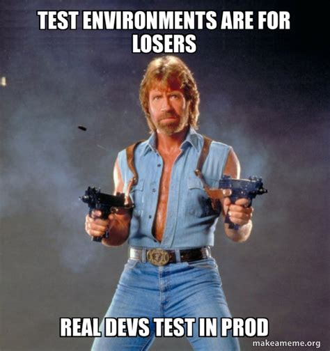
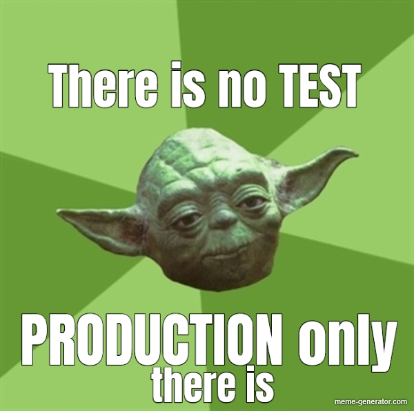
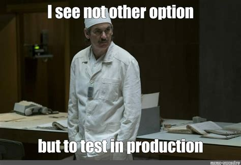
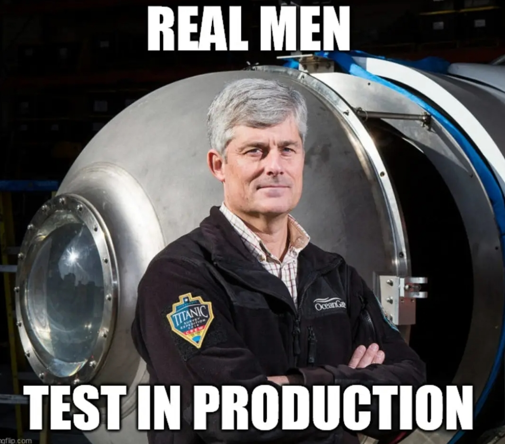
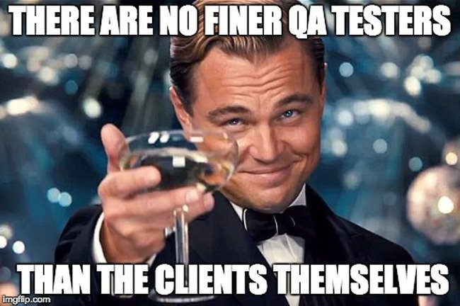
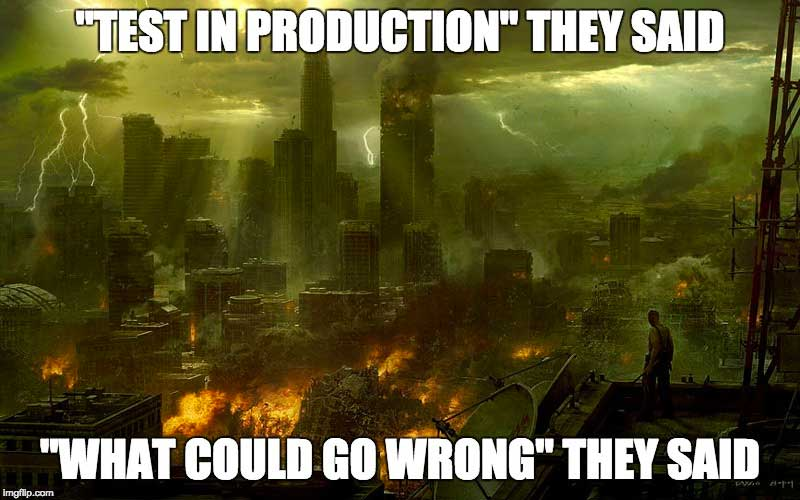
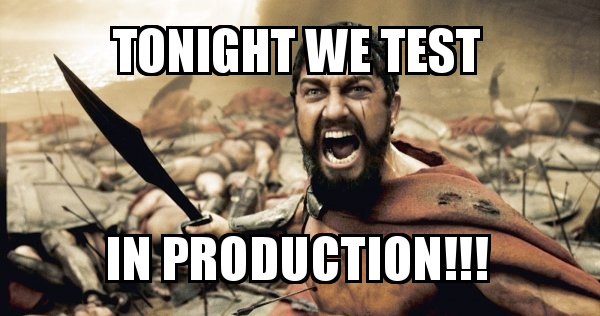
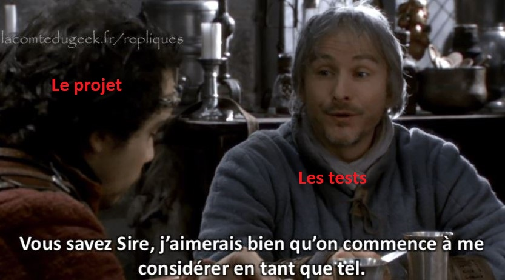

<!-- .slide: data-background-image="./enfer-paradis.jpg" -->

# L'enfer des tests autos

Notes:
* TODO :
  * exemples/anecdotes concrets tout du long
  * exemples de code/archi à la fin
  * ajouter des images
  * pimper la présentation avec un peu de CSS (cf le mkslides_config.yml)
  * voir si on garde ou pas le chemin de crète
* TODO feedback meetup Julien :
  * réutiliser l'image de la qualité selon Rambo
  * mentionner "conduite du changement" lorsqu'on parle de la Culture ?
  * ajouter photo d'Omar Sy "pas de bras, pas de chocolat"
  * la slide sur le feedback fait un peu redite ?
  * ajouter image du bon chasseur
  * mettre l'IDE en light mode, préparer les onglets, ...
  * il y a une slide "fluidité" qui a sauté ou bien ? j'ai loupé un coche
  * trop d'informations ... (mais comment améliorer ?)
  * ajouter une visualisation de la stratégie/pyramide de test (couleurs qui couvrent une archi)

---

# Introduction

-v-

## Merci aux sponsors

- TODO sponsors DevFest Toulouse

Notes:
* TODO: logo Kaizen

-v-

## Présentation

Julien Lenormand 😇

Jonathan Gaffiot 😈
@ Kaizen Solutions

Notes:
* on n'est pas parfait, des fois on ne teste pas (assez), ou pas auto
* plutôt qu'un disclaimer, penser à expliciter qu'on a le choix entre :
  écrire ses tests, ou tester manuellement, et bien souvent en prod

-v-

## Sondage

* Qui trouve que les tests c'est l'enfer ? <!-- .element: class="fragment" -->
* Qui trouve que c'est le paradis ? <!-- .element: class="fragment" -->

---

# Tester c'est le Bien

😇 😇 😇

-v-

## Oui mais... c'est quoi tester ?

* tester = s'assurer de la réponse attendue de la part du système dans un certain état à un stimuli particulier   <!-- .element: class="fragment" -->
  * réponse attendue ?  <!-- .element: class="fragment" -->
  * certain état ?  <!-- .element: class="fragment" -->
  * quel stimuli ?  <!-- .element: class="fragment" -->
  * et les effets de bords de mon système ?  <!-- .element: class="fragment" -->
* 😈 plus de questions qu'avant la définition... <!-- .element: class="fragment" -->

Notes:
* c'est quoi tester ? c'est quoi tester automatiquement ? (moment chiant avec des définitions)
* c'est toujours difficile (et chiant !) les définitions  !
* action, réaction, stimuli, SUT, oracle
  * définiton test = s'assurer de la réponse attendue de la part du système dans un certain état à un stimuli particulier
  * expliciter les pièges :
    + réponse attendue ? oui mais quand effet de bord ? LLM ? résultat de simu ? (besoin d'un oracle)
    + certain état ? c'est quoi les états de mon système ? comment je mets mon système dans un état particulier ?
    + quel stimulus ? quelle réponse ? comment j'y accède ?
    + et les effets de bords de mon système ? ses dépdendances à d'autres systèmes ?
* on est pas bien avancé...

-v-

## Pourquoi tester ?

Qualité avec un grand Q :  <!-- .element: class="fragment" -->
* ISO 9000 : aptitude d'un ensemble de caractéristiques intrinsèques d'un objet (produit, service,...) à satisfaire des exigences  <!-- .element: class="fragment" -->
* Rambo Python : fiabilité, maintenabilité, évolutivité, sécurité  <!-- .element: class="fragment" -->

La qualité n'est pas automatique, surtout pour du logiciel. <!-- .element: class="fragment" -->

Notes:
* Faire du logiciel ce n'est pas si simple

-v-

## Fiabilité du code

* Le logiciel est particulier : complexe, immatériel, fluide  <!-- .element: class="fragment" -->
  + complexe  <!-- .element: class="fragment" -->
    - chaque ligne est une action
    - nécessairement des effets de bord
    - explosion combinatoire des chemins d'exécution
    - empilement de couches de fonctions, d'objets, de librairies
  + immatériel <!-- .element: class="fragment" -->
    - pas d'expérience immédiate, visuelle
    - pas d'inspection
    - pas d'expérience dans la vie de tous les jours
  + fluide <!-- .element: class="fragment" -->
    - change facilement
    - partageable, réutilisable
    - tempo technologique frénétique
* 😈 le code c'est trop dur pour vos petites cervelles d'humains !  <!-- .element: class="fragment" -->

Notes:
* et les autres aspects de la qualité d'après Rambo Python ? maintenabilité/évolutivité/sécurité !
* s'autoriser le refactoring, conserver du code maintenable
* stabilité / perennité / scalabilité humaine-temporelle-technique-complexité-busfactor
  * Tests auto = moyen de scaler dans le temps, la taille, les personnes, les techs, ...
  * pouvoir survivre à un changement d'équipe
* quelle valeur à un logiciel qui ne peut pas être testé automatiquement ? uniquement court-terme
* pas d'autom == risque projet
* une certaine forme de spécification (c'est plus simple de savoir ce que le code doit faire, quand c'est littéralement commité dans le repo)
    * et encore mieux, elle se vérifie toute seule !!
* exécution automatique/systématique -> pas besoin de devoir s'en souvenir (CI, make, ...)
* empêche le "Fear driven development"
  * Comment faire du fearless refactoring sans Rust ni test ?
* évite le "tombé en marche"
* non-reg
* Sens strict de refactoring, pas de refactoring sans garantie que le comportement "observable" (externe) n'a pas évolué
  * nécessaire pour dompter la dette technique

-v-

## Confiance et sérénité

* les tests aident à résoudre ces problèmes :  <!-- .element: class="fragment" -->
  + 😇 vérifier que ce que j'ai changé fonctionne correctement  <!-- .element: class="fragment" -->
  + 😇 vérifier que ce que je n'ai pas changé continue de fonctionner  <!-- .element: class="fragment" -->
  + 😇 vérifier que l'ensemble fonctionne <!-- .element: class="fragment" -->
  + 😇 mise en prod le vendredi !  <!-- .element: class="fragment" -->

* on peut donc :  <!-- .element: class="fragment" -->
  * refactorer ou faire évoluer le code en confiance  <!-- .element: class="fragment" -->
  * avoir des preuves qu'il fonctionne correctement (plus de "tombé en marche") <!-- .element: class="fragment" -->
  * laisser d'autres personnes le modifier  <!-- .element: class="fragment" -->

Notes:
* sérénité

-v-

## Éthique professionnelle

* le code peut être une passion 😇   <!-- .element: class="fragment" -->
* ... et donc une torture ! 😈   <!-- .element: class="fragment" -->
* livrer du "bon" code :  <!-- .element: class="fragment" -->
  * responsabilité perso/pro  <!-- .element: class="fragment" -->
  * "élever le niveau" - devise des crafteurs  <!-- .element: class="fragment" -->
  * une question de maturité ?  <!-- .element: class="fragment" -->

Notes:
* cf Craft et déontologie
* critère de validité de ce qui est livré ("si c'est pas testé, c'est réputé ne pas marcher")
* pas obligé de faire comme les autres
* livraison, recette

-v-

## Rentabilité

* pas simple à mesurer (scientifiquement)  <!-- .element: class="fragment" -->
* Accelerate ?  <!-- .element: class="fragment" -->
* argument d'autorité : <!-- .element: class="fragment" -->
  * Google, Microsoft, Netflix, Apple le font !!!  <!-- .element: class="fragment" -->
  * et tous les projets libres qu'on utilise tous les jours !!!  <!-- .element: class="fragment" -->
* se concentrer sur des tâches à forte valeur ajoutée  <!-- .element: class="fragment" -->

Notes:
* Accelerate
* autres preuves d'efficacité ? (cf scientific proofs)
* se concentrer sur des activités à forte valeur ajoutée, par rapport à répéter des tests
* Seul moyen de tenir la cadence
* est-ce qu'il est vrai que les bugs coûtent + cher à corriger s'ils sont découverts plus tard ? (preuves !!)

-v-

## Pourquoi c'est important les tests autos en particulier ?

Pour garder la maitrise de son code au fur et à mesure de son développement ! 😇  <!-- .element: class="fragment" -->
 * exécution automatique et systématique -> pas d'oubli ! pas de flemme !  <!-- .element: class="fragment" -->

-v-

## Feedback rapide

* UN BUG 😈 !  <!-- .element: class="fragment" -->
  - 😐 trouvé lors de la PR  <!-- .element: class="fragment" -->
  - 😩 trouvé lors des tests en pré-prod  <!-- .element: class="fragment" -->
  - 😢 trouvé en prod  <!-- .element: class="fragment" -->

* Un feedback rapide 😇 <!-- .element: class="fragment" -->
  - facile à exécuter  <!-- .element: class="fragment" -->
  - résultat rapide <!-- .element: class="fragment" -->
  - facile à exploiter : log, stracktrace, débuggueur... <!-- .element: class="fragment" -->
  - indépendant, pas besoin de "QA"  <!-- .element: class="fragment" -->

Notes:
* ownership de la qualité du code, ce n'est pas juste aux QAs, ou utilisateurs de trouver les bugs, "ça marche sur ma machine"
* facile à exécuter : un clic et c'est bon, ça part en prod

-v-

## Évolutivité et maintenabilité

* les tests sont un ingrédient pour la stabilité :  <!-- .element: class="fragment" -->
  * dans le temps  <!-- .element: class="fragment" -->
  * à travers les technologies  <!-- .element: class="fragment" -->
  * malgré les évolutions  <!-- .element: class="fragment" -->
  * pour détecter les régressions  <!-- .element: class="fragment" -->
  * pour survivre à une absence imprévue (bus factor)  <!-- .element: class="fragment" -->
  * pour augmenter efficacement la taille de l'équipe  <!-- .element: class="fragment" -->
  * pour augmenter la cadence de livraison  <!-- .element: class="fragment" -->
* pas de test automatisé = risque projet  <!-- .element: class="fragment" -->

Sondage : <!-- .element: class="fragment" -->

😈 Qui veut mettre en prod 2 ans de code jamais testé ? <!-- .element: class="fragment" -->

😈😈😈 Qui veut faire les tests de 2 ans de code d'un coup ? 😈😈😈  <!-- .element: class="fragment" -->

-v-

## Le paradis !

Fin de la conférence ?

Sauf que...  <!-- .element: class="fragment" -->

  <!-- .element: class="fragment" -->

Notes:
* une fois qu'on s'est dit ça, ça paraît vachement bien, donc y'a aucune raison de pas en faire
* meme avec l'image recto/verso, ville en feu, bébé zombie
  * "Kid Thrown In The Air Meme: How Dad Sees It Vs How Mom Sees It" cf https://i.imgur.com/qL915f0.jpeg
* Stop au masochisme !
* transition vers la partie suivante

---

# Pourquoi c'est difficile les tests autos ?

Faut bien l'avouer !

Notes:
* TODO: ajouter des exemples concrets à chacun
* TODO @jonathan mettre des bouts de paradis

-v-

## Pas le temps

* Pas prévu dans le planning/sprint  <!-- .element: class="fragment" -->
* Mon chef/Product Truc me dit de faire des features  <!-- .element: class="fragment" -->
* Deadline en vue  <!-- .element: class="fragment" -->
* Jamais budgeté, jamais valorisé  <!-- .element: class="fragment" -->
* Projet géré par le marketing sans aucune expérience de la technique  <!-- .element: class="fragment" -->
* De toute façon y'aura bien une validation du produit final...  <!-- .element: class="fragment" -->

Notes:
* convaincre (le management et/ou les devs) que c'est utile, avant de se manger une mise-en-prod foirée
* dépense versus économie
* Résultats intangibles

-v-

## Pas appris

* Rarement au programme des formations de dev <!-- .element: class="fragment" -->
  * Ou alors théorique et très court... 😈 <!-- .element: class="fragment" -->
  * Mais ça s'améliore 😇 <!-- .element: class="fragment" -->
* Peu présent dans la littérature (livres, blogs...), les confs, les formations <!-- .element: class="fragment" -->
  * Alors que c'est souvent ~50% des LoC 😈 <!-- .element: class="fragment" -->
  * Mais on en parle aujourd'hui ! 😇 <!-- .element: class="fragment" -->

Notes:
* JULIEN: anecdote Ensimag, importance pro
* JULIEN: biblio, conférences

<!--
* sauf pour les testeurs de métier, les moldus s'en passeront bien ?
* et encore les testeurs apprennent pas les TU
* pas de formation dans la plupart des cursus master, ou bien théorique ou très court
* assez peu présent dans la littérature généraliste, malgré sa prévalence et importance (cf biblio)
* pas un sujet "sexy" (formation continue, conférences, ...)
* exemple Ensimag, mon cursus versus ce qui est proposé actuellement
    * Mon ècole d'ingé, ni mon DUT ne m'ont enseigné le test
    * Le test ètait une option, une année, d'une filière
    * les cours de Groz sur la vérif statique et la modélisation boite noire
    * Ensimag, examens de SAP en 2014 et 2015 :
      * déterminer les (in)variants de boucle
      * preuve d'arrêt,
      * interprètation abstraite (réduction de machines à états),
      * accès mémoire invalide,
      * valeurs par défaut en Java,
      * détection de la récursion ou de code mort,
      * propagation d'intervalles pour exécution symbolique
      * preuves de comportement de programme
    * https://ensimag.grenoble-inp.fr/fr/formation/analyse-de-code-pour-la-s-ucirc-ret-eacute-et-la-s-eacute-curit-eacute-4mmacss
      * Ce cours est une introduction aux fondements de la sémantique et l’analyse de programmes. Il offre les bases sur lesquelles s’appuyer pour spécifier et développer des applications sûres, construire et se servir d’outils d’analyse et de vérification.
      * Sémantique opérationnelle des langages de programmation.
      * Calcul de plus faible précondition et preuve de programmes.
      * Analyse de flot de données.
      * Analyse statique et interprétation abstraite.
      * Applications à la compilation, à la sûreté et à la sécurité des logiciels.
      * Travaux pratiques à l'aide de 2 outils industriels.
        * (Frama-C et Coq sûrement ?)
    * https://ensimag.grenoble-inp.fr/fr/formation/test-des-syst-egrave-mes-logiciels-5mmtsl6
      * une option parmi 3, pour ceux qui font pas d'Erasmus
      * Présentation des méthodes de test pour assurer la sûreté de fonctionnement des logiciels.
      * Test
      * Vérification et validation
      * Les tests au cours du cycle de vie.
      * Test structurel des logiciels.
      * Test à partir des spécifications: partitionnement, combinatoire.
      * Méthodes de test basées sur des modèles, en particulier automates.
      * Analyse des notions de couverture, test mutationnel.
      * Eclairage sur des domaines de test importants:
        * test de performance et test de charge
        * test d'interface
        * test de sécurité.
      * Cours de génie logiciel abordant notamment les cycles de développement : cela permet de situer correctement le test dans une activité de développement.
      * Bonnes connaissances en algorithmique et programmation : être capable d'analyser un programme, de l'exécuter symboliquement "à la main", fait partie des activités du testeur et est une compétence indispensable pour comprendre les techniques fondées sur l'analyse du code.
      * Langages et automates : une partie du cours porte sur de modèles et en particulier des machines d'états finis exploitées pour engendrer des tests de conformité.
      * Bibliographie :
        * Aditya P. Mathur:Foundations of Spftware Testing, Pearson 2008.
        * J-F. Pradat-Peyre, J. Printz: Pratique des tests logiciels, Dunod 2009.
        * Myers, G.J. : The Art of Software Testing. Wiley 1979; réédité 2004.
    * le cours de dernière année
      * zip de quentin pigné
* "missing semester" ?
* Apprentissage théorique (en études ingé) versus apprentissage empirique de l'informatique (sur le terrain), en particulier du test
* cf analyse de la ibliographie
-->

-v-

## Mais de quoi on parle ?

* Personne n'est d'accord sur rien ! 😈
  * C'est quoi un test unitaire ? Combien j'en fait ? <!-- .element: class="fragment" -->
  * C'est quoi les autres catégories ? Intégration, validation, recette ? C'est quoi la différence ? <!-- .element: class="fragment" -->
  * Plus de pyramides de tests qu'en Egypte ! <!-- .element: class="fragment" -->
  * Quel métier ? QA, testeur, dev, IVVQ, quality manager ? <!-- .element: class="fragment" -->
* Faut en parler ensemble pour se mettre d'accord ! 😇  <!-- .element: class="fragment" -->

Notes:
* TODO: ajouter des images de pyramides !
* personne n'est d'accord sur rien : 47 pyramides différentes, le vocabulaire du test,~~les perspectives tech~~, les rôles, les niveaux de test
* lister et illustrer avec différents types de pyramides
    * blague illuminatis (pyramide)
    * On est des ègyptiens, on a plein plein de pyramides diffèrentes
* Pyramide originale par Mike Cohn dans "Succeeding with Agile" publié en 2009
* Florilège des autres formes : ice cream, hourglass, diamond, upside-down pyramid, trophy (kent beck) ... --> aucune solution universelle
    * https://claude.ai/chat/3ff66008-4cc7-431e-9657-9f4987e7d86c
* Dimensions de la pyramide : vitesse d'exécution, coût à écrire/maintenir, quantité de code exercée, fidélité utilisateur, ...
  * Multiples interprétations des dimensions de la pyramide : quantité, vitesse d'exécution, confiance, spécificité, couverture apportée, coût de production, fréquence de changement / bug, ...
* Le test c'est un sujet transverse our chaque dev, qu'importe le langage, la stack, le métier, ... Donc tout le monde parle de quelque chose avec un point de vue et un focus diffèrent, pas toujours mentionné
* prêt-à-penser
    * dans quels contextes-projets travaillent les différentes personnes qui ont proposé ces pyramides ? et en quelle année ?
    * ne suffit pas pour appréhender le test
    * Testing tools have evolved in 30 years
* jeu des 7314 différences : industrie, technos, maturité du produit, durée de maintenance, culture d'équipe, compétences lacunaires, vitesse, confiance, ...
    * il n'y en a pas qu'une seule, mais une par projet ! chaque projet est différent !
    * chaque projet est (quasi) unique
* anecdote sur le vocabulaire pas unifié : du temps de mon stage en autom de test, j'avais travaillé entre autres sur un glossaire unifié entre ISTQB et CFTL
* meilleure définition des axes : "finalité, granularité, modalité d'assertion" (50 shades ...)
* essayons de poser une définition, dans notre contexte, des mots que nous employons
    * différences entre ISTQB et CFTL, cf mon stage Sogeti
* tous les différents types de test : carac, fonc, integ, unit, acceptance, user-testing, accessibility, composant-unitaire versus composant-UI, e2e-stack ou e2e-scénario...
    * faire une liste exhaustive des noms ?
    * charge : soak, breakpoint, ... (cf doc de k6 avec de jolis graphiques)
        * K6 typologie : breakpoint, soak, stress, load, ...
    * cf ISO 15010
    * peu de personnes, même dans des livres (exemple Clean Code de Robert C Martin "Uncle Bob"), ne font l'effort de définir
    * Pyramyde inversé de la valeur : le haut niveau est le plus pertinent, mais cher et fragile ?
        * Facilitation des tests web d'ui (selenium, cypress, playwright)
* QA analyst/tester vs quality engineer vs testeur-automaticien vs "dev" vs IVVQ vs QA "quality advisor" vs test manager ...
* Test error vs test failure : le test n'a pas abouti pour une raison technique (problème de test), le test a abouti mais n'a pas produit le résultat attendu (problème fonctionnel on espère !)
  * distinction "test qui plante" versus "test qui échoue"
* Imbrication et interconnexion des systèmes : les tests au même endroit n'ont pas le même nom / fonction.
* politique vs stratégie vs plan de test
* E2e : vertical de la stack ? Ou horizontal du parcours utilisateur ?
* Sanity vs smoke ?
* test fonctionnel + non-fonctionnel : si la perf fait partie des requirements, alors fonctionnel ou pas ?
* [le glossaire ISTQB](https://glossary.istqb.org/en_US/search?term=) donne 601 résultats en anglais, 559 en français
* personne n'est d'accord sur les tests, car personne n'utilise les mêmes définition
  * démonstration : pain au chocolat

-v-

## Trop de tests, pas assez ?

* Quelques tests "end-to-end (enfin... plus ou moins... sauf pour la GUI...)  😈 <!-- .element: class="fragment" -->
  * Mais ils prennent des plombes ! <!-- .element: class="fragment" -->
  * Et ils cassent tout le temps ! <!-- .element: class="fragment" -->
  * Et je peux pas les automatiser, il faut que je rentre mes identifiants ! <!-- .element: class="fragment" -->
    * (bon on va créer un user de test... harcoder son mdp quelque part... chut ! 😈) <!-- .element: class="fragment" -->

* 10 ans de tests accumulés 😈 <!-- .element: class="fragment" -->
  * Chaque fonction est testée 10 fois ! <!-- .element: class="fragment" -->
  * Plus de 1000 exigences dans le plan de test ! <!-- .element: class="fragment" -->
  * Ça prend des plombes ! <!-- .element: class="fragment" -->
  * Y'en a toujours 4 ou 5 qui plantent, évidemment qu'on regarde plus si c'est rouge ! <!-- .element: class="fragment" -->
  * Chaque fois que je touche une ligne j'ai 10 tests à modifier ! <!-- .element: class="fragment" -->

* Et pourtant on découvre toujours des bugs ! 😈 <!-- .element: class="fragment" -->

Notes:
* explosion combinatoire
* cible mouvante et floue
* L'explosion combinatoire rend l'exhaustivité impossible
* couplage versus maintenabilité en carton, tests cassés pas réparés ("vitre cassée"), maintenance des tests vécue comme un fardeau
  * le summum : test de mock !
* Tester le mauvais 80% : métaphore du streetlight problem ("plus simple de chercher dans la lumière")
* test flaky
  * l'équivalent de "ptèt bin qu'oui, ptèt bin qu'non"
  * suffit de les relancer plusieurs fois mdr, ~zéro confiance
* lenteur, car tests lents et/ou trop de tests
* exemple de Xavier Nopre (cf [post LinkedIn](https://www.linkedin.com/posts/xnopre_pourquoi-jai-mis-plus-de-3-jours-%C3%A0-trouver-activity-7316027544934191104-Otww)), je lui ai dit qu'il y avait un problème, c'est pas censé être aussi lent
* exemple de Schneider : board farms
* exemple de Schneider : code dont le run dure des centaines jours !! (à travers les timezones :p)

-v-

## Punition ou mauvaise volonté ?

* J'ai pas envie d'écrire des tests, j'ai testé à la mano ça marche ! 😈  <!-- .element: class="fragment" -->
* Mes specs sont dans un Word de 200 pages, je peux pas les tester une par une ! 😈 <!-- .element: class="fragment" -->
* Pas mon boulot les tests E2E, je fais que mes tests unitaires sur MON code ! 😈 <!-- .element: class="fragment" -->
* De toute façon c'est du C++, c'est trop chiant de gérer les effets de bord ! 😈  <!-- .element: class="fragment" -->

Notes:
* des tonnes d'outils différents, les différents types de tests évoqués, les différents métiers, l'insertion dans le process de production, ...
* s'organiser, planifier et réaliser sont des tâches complexes
* l'absence de testeur/expertise/culture dans les projets (des gens formés, motivés, avec le mindset adéquat)
* > On peut conduire un cheval à l'abreuvoir, mais pas le forcer à boire
* certifications ISTQB par le CFTL
* casse-pied de service

-v-

## C'est impossible !

Je peux pas tester...
* j'ai pas le droit de taper sur l'API, elle est payante <!-- .element: class="fragment" -->
* faudrait la DB <!-- .element: class="fragment" -->
* faudrait des identifiants <!-- .element: class="fragment" -->
* c'est de l'embarqué sur une carte maison <!-- .element: class="fragment" -->
* c'est un OS propriétaire obsolète depuis longtemps <!-- .element: class="fragment" -->
* une simu prends 3 jours sur le cluster <!-- .element: class="fragment" -->
* c'est pas reproductible <!-- .element: class="fragment" -->

Notes:
* JULIEN: anecdote "juste" ajouter une route sur API
* Ennemis :
  * side-effects ("spooky action at a distance", "que fait cette méthode ?"),
  * (global/static) state,
  * IO,
  * singletons,
  * time,
  * locale,
  * network,
  * files,
  * env,
  * GPU,
  * unclear pre/post-conditions,
  * non-determinism,
  * (G)UI vs API,
  * concurrency et threading,
  * random (non-deterministic),
  * complex outputs and high dimensionality
* imitations techniques, matérielles, de coût, ... variabilité selon les environnements, pas de données de test (réalistes)
* exemple board farm Schneider
* exemple Windows 10 LTSC 2019 à Thales
* différence entre "c'est compliqué de réaliser le test" (limitations tech) versus "c'est compliqué d'écrire le test" (iceberg, gorille)
* exemple : code des bornes qui échoue le 29 Février
* exemple : code du Edge qui est correct sur la timezone 6 mois par an
* anecdote schneider :
  * on me demande de rajouter un paramètre booléen à une route HTTP, sur un composant sur lequel je n'ai jamais travaillé
  * je me dis je vais le faire en TDD, commencer par écrire un test
  * mais y'a aucun test sur le projet, donc je dois commencer par écrire un test avant
  * j'écris un test, je le lance un fois il passe, deux fois il échoue
  * car il avait une dépendance sur une base de données, laquelle est gérée par un singleton, qui stocke l'état
  * donc je fixturise le singleton pour le réinitialiser (ou le détruire/reconstruire) afin que mon test soit répétable
  * ensuite j'ajoute mon test et le changement est easy
  * (ah, maintenant faut que j'ajoute une CI !!)

-v-

## Trop tard

* De toute façon y'a jamais eu de tests sur ce projet, c'est trop tard ! <!-- .element: class="fragment" -->
* Ça sert à rien de tester ma feature, le reste est pas testé, pis ça m'a pris tellement de temps ! <!-- .element: class="fragment" -->
* Comment j'injecte mon code de test ? Y'a rien qu'est prévu ! <!-- .element: class="fragment" -->
* Comment je sais ce qui se passe ? Y'a à peine de logs et on peut se brancher sur rien ! <!-- .element: class="fragment" -->
* Je teste quoi ? Que ça marche comme maintenant ? Parce que c'est pas clair ce que ça devrait faire ! <!-- .element: class="fragment" -->

Notes:
* JULIEN: anecdote procès

<!--
* descriptivism vs prescriptivism (cf Romeu)
* test de caractérisation OK, mais est-ce que c'est ce que ça devrait vraiment faire ? 🤷
  * bug ou feature ?
  * xkcd workflow https://xkcd.com/1172/
* source de vérité = code ou spec Word ?
-->

-v-

## L'enfer !

Trop difficile de savoir quoi faire, comment faire, de le faire, à exécuter, à analyser,
à maintenir, à faire confiance, pas assez, pas assez bien, pas assez rapide...

On test en prod alors ???  <!-- .element: class="fragment" -->

  <!-- .element: class="fragment stacked" -->
  <!-- .element: class="fragment stacked" -->
  <!-- .element: class="fragment stacked" -->
  <!-- .element: class="fragment stacked" -->
  <!-- .element: class="fragment stacked" -->
  <!-- .element: class="fragment stacked" -->
  <!-- .element: class="fragment stacked" -->

Notes:
* difficile de savoir quoi faire, comment faire, de le faire, à exécuter, à analyser, à maintenir, à faire confiance, pas assez, pas assez bien, pas assez rapide, ...
* Facile à dire de faire "le bon test", mais concrètement ?
  * y'a le bon testeur et le mauvais testeur ...
* transition

---

# Trouver la Voie

Comment faire pour bien tester auto ? Il faut s'aider !

Notes:
* TODO:
  * @julien à chaque section mettre un exemple + anecdote !!!
* TODO : exemples de test
  * fonction pure (mais avec de la complexité interne), quelques cas d'erreur prévus -> tests fonc, table, edge cases, fuzz, property-based
  * fonction qui lit un fichier
  * fonction qui tape une API web : mock, contrat, VCR, fake d'API
  * fonction qui tape une grosse Postgres legacy, nouvelle feature

-v-

<!-- .slide: data-background-image="./Top_Rope_Climbing_5.jpg" -->

Notes:
* métaphore du chemin de crête : facile de redescendre, difficile de rester au bon endroit
* TODO: métaphore escalade ?
* comment le naviguer ? comment être/devenir/rester rigoureux ?
  * discipline d'un moine bouddhiste, ou d'un garde de la reine d'Angleterre

-v-

## Culture de la qualité

> Culture eats strategy for breakfast. -- Peter Drucker (apocryphe !!)

* Il faut avant tout changer la culture de l'organisation / de l'équipe <!-- .element: class="fragment" -->
  * implication de toutes les parties prenantes <!-- .element: class="fragment" -->
  * démarche commune et adoptée, pas juste avoir un casse-pied de service <!-- .element: class="fragment" -->
  * tournure d'esprit requise pour malmener le code ("vicieux") <!-- .element: class="fragment" -->
    * "un testeur rentre dans un bar, il commande ..."
  * humilité <!-- .element: class="fragment" -->
  * responsabilité individuelle + équipe <!-- .element: class="fragment" -->
* Avoir de l'expérience est un vrai plus <!-- .element: class="fragment" -->

-v-

Petit florilège :

> Le test n'apporte pas de valeur (argent) par rapport aux fonctionnalités <!-- .element: class="fragment" -->

> you get paid for "software", not "maintainable software" -- joncroks sur news.ycombinator.com <!-- .element: class="fragment" -->

> Move fast and break things -- Facebook (jusqu'en 2014)  <!-- .element: class="fragment" -->

> I get paid for code that works, not for tests [...] -- Kent Beck (tronqué !!)  <!-- .element: class="fragment" -->

Notes:
* culture qualité, formation (cours, conférences, livres, exercices, katas, ...)
* cf nos recos à la fin, expérience (empirisme)
* compréhension du business et des stakeholders,
* tournure d'esprit (cf joke "un testeur rentre dans un bar, il commande -1 bière, NaN bière, demande où sont les toilettes ..."), "vicieux" pour "casser le code" et non pas seulement montrer qu'il fonctionne
* exemple : SQLite testing, test code ratio, test harnesses, ... (+évolution dans le temps)
* le code il faut le malmener
* la qualité c'est un ensemble de tamis successifs : empilement de couches pour attraper les bugs, du besoin, design, archi, implem, test, validation, déploiement
  * processus/démarche au niveau de l'équipe/projet/entreprise/...
* exemple : NDP Systems
* "Le test n'apporte pas de valeur (argent) par rapport aux fonctionnalités"
* Humilité de devoir tester
* "move fast and break things"
* https://news.ycombinator.com/item?id=13130991 : you get paid for "software", not "maintainable software"
* Avoir un "Patrick" (ou whatever name) dans son équipe, éternellement vigilant, le "relou"
* comme beaucoup de sujets, c'est pas un casse-pied de service qu'il faut, mais un changement de culture (beaucoup plus compliqué, cf Agile bullshit, sécurité, ...)
* Responsabilité individuelle et d'équipe
* la qualité c'est une démarche, un tamis, un empilement (vrai sens de Kanban), une culture (LEAN, Kanban "right the first time")
* market cap de Facebook en 2014 >= 140 milliards de $

-v-

## Investissement

> Pas de bras, pas de chocolat ! -- Omar Sy

* Une suite de tests autos est un logiciel, dont le but est de vérifier le bon fonctionnement d'un autre <!-- .element: class="fragment" -->
* Il s'agit d'un second système, qui sert à stabiliser le premier <!-- .element: class="fragment" -->
  * Il n'apporte pas de valeur directe au client, mais aide le premier à en apporter (comme la doc, la CI, le marketing...) <!-- .element: class="fragment" -->
* C'est un investissement <!-- .element: class="fragment" -->
  * Il faut des ressources : temps, compétences, hardware, runner de CI, données...
  * Le meilleur moment pour investir dedans, c'était hier, le second meilleur c'est aujourd'hui <!-- .element: class="fragment" -->
  * Il est d'autant plus rentable qu'on l'utilise (enabler !) <!-- .element: class="fragment" -->
  * Analyse coût-bénéfice, ROI (return on time invested) <!-- .element: class="fragment" -->
* Exemple (extrême !) de SQLite : 590x plus de code de test que de code de prod <!-- .element: class="fragment" -->

-v-

 <!-- .element: class="fragment" -->

Notes:
* Pas de spec ...
* Pas le temps ...
* Pas les compétences ...
* Pas les outils ...
* Pas le hardware ...
* Pas les moyens de déployer ...
* Pas de data de test ...
* humains, techniques, temporels, ...
* outils de test, formations, avoir le temps, déployabilité, disponibilité du hardware, dispo des data, ...
* avoir des specs ! (claires)

-v-

> I find that when someone's taking time to do something right in the present, they're a perfectionist with no ability to prioritize, whereas when someone took time to do something right in the past, they're a master artisan of great foresight.

  <!-- .element: class="fragment" -->

Notes:
* investissement dans un second logiciel pour mieux produire le premier
* outils de test
* investir dans le futur
* projet logiciel = le code qui part en prod, mais pas seulement, aussi : la doc, la CI, les specs, et donc aussi les tests, ...
* "Le test n'apporte pas de valeur (argent) par rapport aux fonctionnalités" (et les fonctionnalités non plus d'ailleurs, ça dépend si elles sont connues, utilisées, ...)
* Second-système de stabilisation du premier, par opposition à la flexibilité
* Une sécurité, ou un frein ? les deux ?
* exemple de SQLite (x 590)
* Vraiment à retenir : ne pas penser le test comme un après, mais comme un même temps, voire enabler
* estimer le ROI de l'automatisation : gain versus coût ? matrice
  * c'est un gros sujet pour les Test Managers, et les chefs de projets
* le meilleur moment pour commencer à mettre des tests sur le projet c'était le premier jour, le second meilleur moment c'est aujourd'hui
* https://xkcd.com/974/ "The General problem" (et sa caption : perception de perfectionniste versus maître-artisan)
* https://xkcd.com/1205/ "Is it worth the time?"
* Le code pourrit sans test auto, mais les tests auto eux-mêmes pourrissent, ou peuvent pourrir (vérouiller) le code
* J'avais un problème, maintenant j'en ai deux (un nouveau)
* le test c'est une analyse coût-bénéfice : combien je veux mettre dans mes tests, pour le run de mon dev et de ma prod
* des tests systèmes pas effectués = risque business
  * exemples : 8 bcs biologic, 50 bornes schneider, ...

-v-

## Stratégie de test

* Première question : POURQUOI je teste ? Qu'est-que je veux obtenir ?  <!-- .element: class="fragment" -->
* Exemple de raisons de tester : <!-- .element: class="fragment" -->
  * Garantir la qualité <!-- .element: class="fragment" -->
  * Eviter les régressions <!-- .element: class="fragment" -->
  * Valider les spécifications/exigences <!-- .element: class="fragment" -->
  * Se rassurer <!-- .element: class="fragment" -->
  * Apprendre à tester, essayer le TDD <!-- .element: class="fragment" -->
  * Diluer les responsabilités <!-- .element: class="fragment" -->
  * Cocher une case <!-- .element: class="fragment" -->
* Deuxième question : quelles sont mes contraintes et mes ressources ? <!-- .element: class="fragment" -->
* Troisième question : quel est mon périmètre ? Qu'est-ce qui dépend de moi ou pas ? <!-- .element: class="fragment" -->
* Quatrième question : dans mon périmètre, comment puis-je le découper ? <!-- .element: class="fragment" -->

-v-

## Stratégie de test 2

* Maintenant on peut définir quel code on va tester, et jusqu'où <!-- .element: class="fragment" -->
  * Souvent on tombe sur une pyramide, des tamis successifs pour attraper les bugs  <!-- .element: class="fragment" -->
    * plein de petits tests de fonctions, quelques tests de l'ensemble  <!-- .element: class="fragment" -->
    * du besoin à la prod, et toutes les étapes intermédiaires  <!-- .element: class="fragment" -->
* Une stratégie à écrire ! <!-- .element: class="fragment" -->
* Une stratégie à faire évoluer au fur et à mesure ! <!-- .element: class="fragment" -->
* La suite de test est un sous-projet en soi, à considérer en tant que tel.<!-- .element: class="fragment" -->

  <!-- .element: class="fragment" -->

Notes:
* quoi pourquoi pour quoi comment qui quand ...
* spécifications, Exigences et Requirements, business (value stream) et risques business, quadrants, matrice confiance versus risque, moyens (et toute la suite)
  * cartographier les flux d’information, les cas d’usage, les frontières techniques et les domaines de l’application afin de discerner les frontières des tests
* construisez votre "pyramide" (demander à une IA différente pyramides, de plein de formes différentes à la Dali), en se basant sur les moyens de test
* à adapter/repenser régulièrement, comme tout le reste
* pourquoi, pour quoi, quoi, où, qui, quand et comment, ...
* trust boundaries (dépendences externes, parties peu fiables, risque métier, responsabilité, vitesse d'évolution, ...)
* Repenser la strat fréquemment, tout comme on le fait pour l'architecture de la solution
* considérer les niveaux de test : Fonctionnalités techniques (endpoint) versus user
* Quadrant des tests !! Axes : business vs tech, pour le produit vs èquipe
* dépendences externes (on ne les controle pas, c'est compliqué, et elles peuvent changer sans qu'on y prête attention) versus dépendances internes (on les controle, mais c'est quand même compliqué, et peuvent changer si on ne fait pas assez gaffe)
* Choisir l'effort de test par périmètre = choisir là où on préfère diminuer la proba d'un bug
* contrats (boundaries)
* Plan de test au format IEEE 29119-3 (ou pas !)
* Le système testé peut faire partie d'un sur-système, et se composer de sous-systèmes, les composants des uns sont les acceptation des autres
  * Ce qui dépend de nous versus ce qui ne dèpend pas (stoïcisme)

-v-

## Renoncer

> Choisir, c'est renoncer -- citation d'André Gide (déformée)

* Impossible de tout tester, tester c'est choisir <!-- .element: class="fragment" -->
  * Impossible de tester toutes les entrées possibles <!-- .element: class="fragment" -->
  * Impossible de tester tous les chemins d'exécution   <!-- .element: class="fragment" -->
  * Pas forcément pertinent de viser les 100% de couverture <!-- .element: class="fragment" -->
  * Pas toujours pertinent d'automatiser : trop compliqué, trop cher... <!-- .element: class="fragment" -->
    * Il faut alors prévoir une procédure de tests manuels !
* Mettre les efforts sur les parties critiques <!-- .element: class="fragment" -->
* Tenir compte du retour d'expérience (qu'est-ce qui a buggué méchamment ?) <!-- .element: class="fragment" -->
* On peut supprimer des tests : pas fiables, trop lents, redondants... <!-- .element: class="fragment" -->
* On doit refactorer ses tests, leur faire suivre la croissance du logiciel <!-- .element: class="fragment" -->

Notes:
* renoncer à tout automatiser (quadrants, moyens insuffisants, ...), ROI
* tradeof : cout, risque, complexité, ...
* critère qui favorisent l'automatisation : répétition, confiance dans l'autom, pénibilité, longueur, criticité, ...
* il vaut mieux un mix d'autom et de manuel, la force de chacun
* Le coût des tests est parfois supérieur aux benéfices
* exemple : lecteur de fichier à EDF
* Tester le code techniquement complexe, sensible pour le métier, et utile
* loi de pareto 80/20 : toujours fausse, toujours vraie
* hybrid possible aussi (soit manuel assisté par autom, soit autom avec verif manuelle) : continuum Automatisé-automatisable-manuel
* Sans jugement : un pas après l'autre, on hérite de codebases, on essaye de faire mieux
  * incrémental
* tester ne prouve pas l'absence de bugs, mais en élimine certains
* process avec des rendements décroissants, trouver le bon curseur, le bon équilibre
* garder des tests qu'on apprécie : rapides (ou moins rapides en CI mais + couvrants), fiables, maintenables, estimer le ROI
* OK de supprimer un test inutile
* fatalisme, tout tester en auto est un voeu pieux
* Choisir ses batailles, mettre les efforts au "bon" endroit
* à tester = risque business + risque tech + facilement automatisable >= 1

-v-

## Scénarios

* On sait pourquoi on teste, ce qu'on teste, et avec quel moyens. Quels tests alors ?
  * Test globaux <!-- .element: class="fragment" -->
    * Exemple : Cas d'usage utilisateur, test end-to-end
    * Test de l'ensemble du système, à partir de son interface utilisateur
    * 😇 Assez court à écrire, test beaucoup de code d'un coup
    * 😈 Tend à être fragile, à ne tester que le chemin d'exécution attendu
  * Tests de function <!-- .element: class="fragment" -->
    * Appel une fonction/méthode et vérifie sa sortie
    * Le plus souvent isolé du reste du système en coupant les effets de bords
      * Idéal pour les fonctions sans effet de bord (maths...)
    * 😇 Spécifique, facile à garder en tête, indépendant
    * 😈 Beaucoup de tests à écrire, peut ne pas tester grand chose
  * Tout le reste entre les deux ! <!-- .element: class="fragment" -->
  * Une feature = un test ?  <!-- .element: class="fragment" -->
  * Dépend de ses objectifs, ses moyens, son expérience...  <!-- .element: class="fragment" -->
      * Juste vérifier que le code compile et s'exécute ?
      * Décliner les spec ? (top-down)
      * Ajouter un test à chaque bug ? (bottom-up)

Notes:
* scénarios de test (nominaux, critiques, ...) décidés, "use cases" (orientés "utilisateur" de l'interface)
* TODO retravailler cette section, semble un peu redite avec la stratégie
* typologie de test : "unitaire au niveau technique (méthode/classe)", ou "unitaire d'interface mais profond"
* avoir une spec
  * Exigences et Requirements (cf Schneider, Thales, ...)
* value streams, risques, manque de confiance, ...
* smoke tests (cf origine du mot "smoke test" en logiciel)
* quoi tester ? critique ou sujet à forte régression, et stable, fréquence d'exécution
* (reprendre des tamis) : tres amigos, example mapping, BDD, prise en compte de la testabilité dès la (pré-)conception, compter le coût du test dans l'estimation de la story, les tests font partie de la dette technique du projet, analyse d'impact lors de nouveaux devs, découpage en équipe Dev versus QA ??
  * identifier les manquements dans son équipe, sur son projet, et trouver comment communiquer dessus avec les autres, avoir des idées à proposer

-v-

## Architecture testable

* si ce n'est pas un objectif, alors ce sera négligé
* si le code n'est pas facilement testable, alors les tests seront difficiles   <!-- .element: class="fragment" -->
* bien définir les interfaces et contrat (cf juste après)   <!-- .element: class="fragment" -->
* identifier les "seams" (couture, lignes de faille, ...)   <!-- .element: class="fragment" -->
* privilégier les fonctions "pures" (sans effets de bord) quand c'est possible   <!-- .element: class="fragment" -->
  * "functional core, imperative shell"
  * limiter la mutabilité
* choisir quand limiter le couplage   <!-- .element: class="fragment" -->
  * inversion de dépendance

Notes:
* sinon architecture intestable ou semi-testable
* seams (cf Michale feathers, Working effectively with legacy code) versus scalpel et pied-de-biche
* dépendances, interfaces, contrats, ... "trust boundaries"
* you can't write good tests for badly written code
* version de dev, suffisament isoprod mais avec des backdoors
* attention au couplage : ni trop peu, ni pas assez (monolithe spaghetti versus micro-services passe-plats)
  * plus simple de tester des fonctions (niveau code) que des programmes
* functionnal core, imperative shell (ou héxagonal, ou onion)
* pousser les IO à l'extérieur (technique du sandwich)
* design goal sinon accidentel
* critère d'acceptabilité
* state is the enemy, prog fonctionnelle
* narrow interfaces for deep modules
* "fracture planes" de Team Topo, selon des "lignes de faille" (user persona, tech, change cadence, regulatory compliance, team location, risk, performance isolation, ...)
  * cf https://teamtopologies.com/key-concepts-content/finding-good-stream-boundaries-with-independent-service-heuristics
  * cf https://yoan-thirion.gitbook.io/knowledge-base/xtrem-reading/resources/book-notes/team-topologies#software-boundaries-or-fracture-planes
* sans architecture testable, la strat s'effondre !
* introduire des interfaces au bon endroit pour casser la combinatoire (passer de la multiplicaton des cas à l'addition)

-v-

## Surface d'interface

> good cut point has narrow interface with rest of system: small number of functions or abstractions that hide complexity demon internally, like trapped in crystal
> -- grugbrain.dev

* interface = surface de contact entre deux systèmes <!-- .element: class="fragment" -->
  * les méthodes publiques d'une classe, les fonctions d'un module, leurs types et exceptions
* interface = abstraction <!-- .element: class="fragment" -->
* tout est une API <!-- .element: class="fragment" -->
* surface large = trop de choses à tester <!-- .element: class="fragment" -->
  * garder le minimum (SRP)
  * (complique le refactoring)
  * la profondeur c'est OK
* tester l'interface, pas l'implémentation <!-- .element: class="fragment" -->
  * contravariance des tests (refactoring !)

Notes:
* un critère primordial pour faciliter la testabilité : maîtriser la surface (de test) du code
* Tester aux frontières d'une interface, que ce soit une méthode privée, publique, classe, module, programme, sous-système, système, sur-systeme
* facile pour des modules narrow-interface mais deep, impossible pour des hubs
* les "unit" tests n'ont pas vocation à tester le moinds de lignes possible, mais à tester des APIs
* Ne pas tester tout le code ? Cf couverture, et faire des tests croisés
* Quantité de test versus qualité
* contravariance, tester l'interface plutôt que l'implémentation, cf Uncle Bob https://blog.cleancoder.com/uncle-bob/2017/10/03/TestContravariance.html
* bon test = SRP + behavior not implementation
* niveau de test :
  * Test u = contrat dev
  * Test inté = contrat intégrateur
  * Test accep = contrat user
* Exercer le système depuis l'extérieur
  * ok pour du e2e
  * un désastre pour en tester des sous-parties (banane, gorille, jungle)
* "mock roles, not objects" - in "Growing Object-Oriented Software, Guided by Tests" by Steve Freeman and Nat Pryce

-v-

## Feedback

* les tests sont les premiers utilisateurs de notre code
  * du code peu testable se voit immédiatement ! et ça se propage !
* A la fin du dev, il est parfois trop TARD pour corriger le tir : Shift Left <!-- .element: class="fragment" -->
  * il fallait le prendre en compte lors de l'implémentation, du design, du poker, de la story ...
* A la fin du dev, il est parfois trop TOT pour corriger le tir : Shift Right <!-- .element: class="fragment" -->
  * ça part en prod en on surveille (feature toggle, monitoring, metrics)
  * (beaucoup plus sérieux que dire "je teste en prod")
* le test est une considération tout du long du process : TestOps, Full Cycle <!-- .element: class="fragment" -->
  * éviter la loi de Conway : les testeurs testent, les autres s'en fichent
* le bon test : il ne passe tout le temps ni n'échoue tout le temps, il échoue pour les bonnes raisons  <!-- .element: class="fragment" -->
  * le bon chasseur ...

Notes:
* un test qui pète, c'est une bonne nouvelle : un bug de moins en prod !
* les bugs viennent aussi de la code review, la spec, le process, les communications...
* les bugs ne sont pas que des erreurs mais aussi des occasions d'améliorer
  * (beaucoup plus sérieux que dire "c'est pas un bug mais une feature")
* un signal (au sens de la "théorie de l'information")
* fast feedback + CI/CD + DevOps (monitoring, observability), frequent deployment, Monitoring, debuggability (shift right)
* Feedback lors du dev, test, code review, design, recette, bugs en prod : tout renseigne sur ce qui mérite d'être testé et comment (shift left)
* tester en prod avec le devops : canary, green-blue, ...
* Les tests doivent planter de temps en temps, pour les bonnes raisons
  * Signal et feedback
  * Doivent ne pas échouer tout le temps (sinon signe de couplage) ni jamais (signe que rien n'est testé). Doivent être un signal, ni zéro ni un. Équilibre difficile.
* Les tests qui pètent (pour une bonne raison) c'est moins de bugs en prod, qui est l'objectif principal.
* luter contre la "loi de conway" : les devs versus les testeurs, cf Full Cycle
* pas de "ça marche sur ma machine"
* du code difficile à tester va engendrer + de tests fragiles, sans améliorer le design, qui va empirer, et ainsi de suite

-v-

## Rester fluide

> Docteur, quand j'appuie là, j'ai mal !
> Alors n'appuyez pas là.
> -- blague

> If it hurts, do it more often.
> -- core XP principle

* Pente glissante de la qualité 😈 <!-- .element: class="fragment" -->
  * Si les tests sont difficiles à lancer, ils le seront de moins en moins  <!-- .element: class="fragment" -->
  * Si les tests ne sont pas fiables, ils seront de moins en moins regardés  <!-- .element: class="fragment" -->
  * Si les tests sont lents, la suite de test sera de plus en plus lente <!-- .element: class="fragment" -->
* Identifier les "pain points" et les résoudre 😇  <!-- .element: class="fragment" -->
  * ajouter un test doit être simple et rapide
  * lancer les tests doit être simple et rapide

-v-

## Accélérer ses tests ?

* Tests trop lents (~15 min), alors refactorisation de la suite de test 😇 <!-- .element: class="fragment" -->
  * Parallélisme ?
  * Optimisation des tests lents ?
  * Séparation en 2 suites, une rapide et une complète ?
  * Framework de test plus évolué ?
  * Lancement sélectif des tests selon les fichiers modifiés ?
* Corollaire : éviter (autant que possible) 😈  <!-- .element: class="fragment" -->
  * les micro-services
  * les submodules
  * les tests dans un repo à part
  * ...

Notes:
* ne pas être capable de réaliser les tests rapidement diminue l'itérativité, la qualité, l'agréabilité, ... la probabilité qu'ils soient écrit tout court
  * comme un évier plein de vaisselle (cercle vicieux)

-v-

## Ecriture

Quelques règles d'écriture pour les tests :

* setup et teardown pour préparer/décomissionner les ressources nécessaires <!-- .element: class="fragment" -->
* structure du test en Arrange-Act-Assert ou Given-When-Then <!-- .element: class="fragment" -->
* au moins un assert par test <!-- .element: class="fragment" -->
* tenter de tester une seule chose par test plutôt qu'une suite de stimuli <!-- .element: class="fragment" -->
* FIRST = Fast, Independant, Repeatable, Self-Checking, Timely <!-- .element: class="fragment" -->
* différencier "erreur" (plantage, pas de résultat de test) versus "échec" (résultat négatif) <!-- .element: class="fragment" -->

Notes:
* méthodologie d'écriture : setup/teardown, Given/When/Then, Assert/Arrange/Act, tester une seule chose plutôt qu'un scénario complet, erreur versus échec
* FIRST : https://stackoverflow.com/questions/18024785/tdd-first-principle Fast Indep Repeat Self-Check Timely (pas écrit dans 1000 ans mais avec le code à tester)
  * double i : isolation ?
  * test FIRST : Timely ou Thorough ?
* un test sans assert = red flag
* unit test = focus, sinon scénario utilisateur end-to-end
  * sinon "Shotgun unit testing" : le test fait tout et n'importe quoi

-v-

## Techniques

Le minimum à maîtriser selon nous :

* la mise en place de son environnement de test, en local et en CI <!-- .element: class="fragment" -->
  * peut être très simple avec certains projet, moins pour d'autres
* le framework de test standard de son langage <!-- .element: class="fragment" -->
  * vous n'êtes pas seuls avec vos problèmes de tests 😇
* les techniques d'isolation des effets de bord : fakes, mocks, TestContainers... <!-- .element: class="fragment" -->
* les techniques de lisibilité et de factorisation des tests <!-- .element: class="fragment" -->

Notes:
* ce qu'on considère le minimum à maîtriser pour tester
* test harness
* TestContainers
* framework
* mocking et fakes versus simulateurs/émulateurs, oracles
  * qu'est-ce je gagne et je perds si je mocke ? gain = vitesse d'exec + facile à mettre en oeuvre (autospec), perte = maintenabilité et réalisme
* DB in-memory

-v-

## Techniques avancées

* IA pour les tests <!-- .element: class="fragment" -->
* couverture de test  <!-- .element: class="fragment" -->
* snapshot testing  <!-- .element: class="fragment" -->
* fuzzing  <!-- .element: class="fragment" -->
* tests d'architecture  <!-- .element: class="fragment" -->
* tests de performance et de charge  <!-- .element: class="fragment" -->
* Page Object Model (POM) pour les tests d'UI  <!-- .element: class="fragment" -->
* Accelerate <!-- .element: class="fragment" -->
* ...   <!-- .element: class="fragment" -->

Juste le sommet de l'iceberg ! <!-- .element: class="fragment" -->

(le reste en annexe et dans les sources des slides)  <!-- .element: class="fragment" -->

Notes:
* pour aller + loin (et qui mérite chacun son 45 minutes ou +) pour développer culture et savoir-faire

---

# Conclusion

* Le test est indispensable, l'automatisation (partielle) aussi <!-- .element: class="fragment" -->
* Le test n'est pas simple, il faut l'apprendre et acquérir de l'expertise <!-- .element: class="fragment" -->
* Il faut l'initier, construire du consensus quand on n'est que dev <!-- .element: class="fragment" -->
* Le test fait partie intégrante de l'ingénierie logicielle <!-- .element: class="fragment" -->

Notes:
* expertise indispensable, il faut s'y mettre, dans un environnement semi-hostile (vocab, équipe, rythme, outillage, ...) -> CI, run local. C'est une partie de l'ingénierie

---

# Nos recommandations

* Titus Winters, Tom Manschrek et Hyrum Wright - Software Engineering at Google ([online](https://abseil.io/resources/swe-book))
* Michael feathers - Working effectively with legacy code
* [BiteCode - Testing with Python (part 4): why and what to test?](https://www.bitecode.dev/p/testing-with-python-part-4-why-and)
* [Dwayne Richard Hipp - How SQLite Is Tested](https://www.sqlite.org/testing.html)
* [Adam Bender - SMURF: Beyond the Test Pyramid](https://testing.googleblog.com/2024/10/smurf-beyond-test-pyramid.html)
* [Miško Hevery - Writing Testable Code](https://testing.googleblog.com/2008/08/by-miko-hevery-so-you-decided-to.html)
* [Jeremy Sorent - J'écris de tests sans pleurer maintenant](https://www.youtube.com/watch?v=2S9TxoTE8BA)
* [Gary Bernhardt - Boundaries](https://www.destroyallsoftware.com/talks/boundaries)
* ... et 27 autres en annexe !

Notes:
* Avis de Julien, pourquoi recommander :
  * Jeremy Sorent - J'écris de tests sans pleurer maintenant
    * un talk assez similaire à celui-ci dans l'intention, mais recentré sur le design du code
  * Michael feathers - Working effectively with legacy code
    * ça parle beaucoup beaucoup de test, et surtout de comment reprendre le contrôle une fois que ça a dérapé !
  * Dwayne Richard Hipp - How SQLite Is Tested
    * un exemple de comment n'avoir quasi aucun bug pour un des logiciels les plus utilisé au monde
  * Adam Bender - SMURF: Beyond the Test Pyramid
    * un exemple par Google de détricoter la pyramide des tests dans une vision complémentaire des tests selon leurs propriétés techniques
  * Miško Hevery - Writing Testable Code
    * un ensemble de bons conseils pour rendre son code testable, dont le premier point ("Mixing object graph construction with application logic") est trop méconnu
  * BiteCode - Testing with Python (part 4): why and what to test?
    * pas si spécifique à Python, toute la série d'articles vaut le détour, mais cet épisode s'attarde sur, sans le nommer ainsi, la stratégie de test
  * Gary Bernhardt - Boundaries
    * comment découper son application pour faciliter sa testabilité (notion de "context domain" du DDD)
  * Titus Winters, Tom Manschrek et Hyrum Wright - Software Engineering at Google
    * de très bonne qualité, et parle significativement de test

---

# Crédits photos

* [mème de source inconnue, sur yaplakal.com](https://s00.yaplakal.com/pics/pics_preview/4/4/7/10845744.jpg)
* [image de voie d'escalade, sur Wikimedia](https://commons.wikimedia.org/wiki/File:Top_Rope_Climbing_5.jpg)
* [mèmes de "test en prod", via Google Images](https://www.google.com/search?udm=2&q=test+en+prod)

---

# Remerciements

* Damien Roulier
* Eric Papazian
* Mathieu Mattringe
* Rachel Da Silva
* Francky Flamant
* Fanny Velsin
* Victor Lambret

---

# Questions

Slides : [https://github.com/Lenormju/talk-enfer-test-autos/](https://github.com/Lenormju/talk-enfer-test-autos/)

Notes:
* TODO QRcode vers les slides : https://github.com/Lenormju/talk-enfer-test-autos/

---

# Plus de recommandations !!

* [Joel "on Software" Spolsky - Hard-assed Bug Fixin’](https://www.joelonsoftware.com/2001/07/31/hard-assed-bug-fixin/) : est-ce que tous les bugs devraient être corrigés ? ça dépend.
* [Mathieu Eveillard - 50 shades of tests](https://www.mathieueveillard.com/blog/50-shades-of-tests) : des définitions plutôt claires pour différents types de test, leur positionnement sur 3 dimensions, au-delà de la pyramide de tests
* [Marc Hage Chahine (La Taverne du Testeur) - Que doit-on attendre d’un testeur ?](https://latavernedutesteur.fr/2025/09/15/que-doit-on-attendre-dun-testeur/) : les différentes dimensions du métier de testeur
* [Arnaud Lemaire - From code to consequences](https://www.youtube.com/watch?v=muRdH9u7gO4) : en quoi les "full cycle engineers" sont importants pour mener à bien des projets
* [Colin Damon - Ma typologie de tests et leur équilibrage](https://www.linkedin.com/posts/colin-damon_mettre-en-place-une-strat%C3%A9gie-de-tests-qui-activity-7343525861444247552-6BJY) : un exemple de "pyramide" dans un contexte précis
* [Redowan Delowar - Test state, not interactions](http://rednafi.com/go/test-state-not-interactions/) : pourquoi les tests proposés par des LLMs ne sont pas nécessairement les bons, et comment faire mieux (par exemple privilégier les fakes aux mocks)
* [Jeff Atwood (CodingHorror) - Falling Into The Pit of Success](https://blog.codinghorror.com/falling-into-the-pit-of-success/) : comment ne plus avoir besoin de se battre pour que la qualité ne dégringole pas ?

-v-

* [Antoine Mazure - Tests pragmatiques : comment presque arrêter les tests automatisés ?](https://www.youtube.com/watch?app=desktop&v=ohV6GvCIeLY) : un exemple de tester la mauvaise chose, et de comment mieux tester avec pourtant moins de tests
* [Jules Poissonnet et Antoine Caron - Tester c'est tricher)](https://www.youtube.com/watch?v=I_zNxGqRI3w) : une vision d'ensemble, claire et illustrée, de la démarche de test, du vocabulaire et des difficultés
* [Christophe Bréheret-Girardin - Comment une architecture influence votre stratégie de test ?](https://m.youtube.com/watch?v=IeOa6XWxkxg)
* [Ham Vocke - The Practical Test Pyramid](https://martinfowler.com/articles/practical-test-pyramid.html) : des exemples concrets dans un contexte clair de différents types de test, et des limitations de la pyramide de Mike Cohn
* [Martin Fowler - Mocks Aren't Stubs](https://martinfowler.com/articles/mocksArentStubs.html) : définitions claires de tous les "*test doubles*" (dummy, stub, fake, spy, mock) par Martin Fowler
  * [Martin Fowler - Test Double](https://martinfowler.com/bliki/TestDouble.html) : en version ultra-abrégée
* [Anaël Lefebvre - Comment en finir avec la fragilité des tests unitaires](https://www.sqli.com/fr-fr/insights/comment-en-finir-avec-la-fragilite-des-tests-unitaires) : un contexte clair, une explication de FIRST, et une méthodo ("ZOMBIES") pour identifier les cas de test
* [The Grug Brained Developer - Testing](https://grugbrain.dev/#grug-on-testing) : des conseils de programmation pertinents, mais rédigés par "Grug" qui a une capacité limitée, et qui le revendique (!)

-v-

* [Qalisty et Anaïs Fournier - Comment s’en sortir lorsqu’on est 1 testeuse face à 25 développeurs ?](https://open.spotify.com/episode/1nwA9nLdezVk6mzWu39T7a) : des techniques concrètes pour mettre en place une culture qualité et une stratégie
* [Victor Lambret - Le TDD sans commencer par les tests](https://www.youtube.com/watch?v=Ddarw3wUXQY) : comme d'habitude avec Victor, un avis mesuré et avant tout sourcé, sur le pragmatisme à conserver face aux techniques TDD/TestFirst/TestAfter
* [Mike Wacker - Just Say No to More End-to-End Tests](https://testing.googleblog.com/2015/04/just-say-no-to-more-end-to-end-tests.html) : les tests unitaires seraient ceux qui compte le plus, du point de vue des utilisateurs (?!), car ce sont eux qui trouvent efficacement les bugs
* [Simon Stewart - Test Sizes](https://testing.googleblog.com/2010/12/test-sizes.html) : caractérisation des tests (en un tableau), non pas en unitaires versus end-to-end, mais en small versus big, en fonction de leurs IO
* [Igor Roztropiński - Unit, Integration, E2E, Contract, X tests: what should we focus on?](https://binaryigor.com/unit-integration-e2e-contract-x-tests-what-should-we-focus-on.html) : de l'intérêt de favoriser les tests d'intégration ("in-between", n'étant pas extrêmes), et les tests de contrat
* [Kent C. Dodds - Write tests. Not too many. Mostly integration.](https://kentcdodds.com/blog/write-tests) : introduit la pyramide "trophy" (en incluant les tests statiques) pour des applis JS, avec surtout des tests d'intégration
* [Seb Rose - Making a meal of architectural alignment and the test-induced-design-damage fallacy](https://claysnow.co.uk/architectural-alignment-and-test-induced-design-damage-fallacy/) : une bonne leçon d'équilibre et de pragmatisme

-v-

* [IFTTD #43.src - Test: Tester c'est douter avec Arnaud Lemaire](https://open.spotify.com/episode/2gRex0ajRA1oVc7DZBL0B9) : TODO @Julien
* [Cécilia Bossard et Angi Guyard - On n’aurait pas oublié un truc dans le craft !?](https://www.youtube.com/watch?v=yVmKkRH60VI) : spoiler il s'agit des tests utilisateurs
* [Gary Bernhardt - Fast Test, Slow Test](https://www.youtube.com/watch?v=RAxiiRPHS9k) : comment choisir entre des tests rapides et des tests lents, en fonction du feedback qu'ils donnent
* [Brandon Rhodes - The Clean Architecture in Python](https://www.youtube.com/watch?v=DJtef410XaM) : à quels problèmes elle répond et comment la mettre en place
* [J.B. Rainsberger - Integrated Tests Are A Scam](https://www.youtube.com/watch?v=fhFa4tkFUFw) : une vision très centrée sur les tests de contrat, pour pousser les "tests d'intégration" à ne porter que sur l'anneau externe de l'application, en interaction avec son environnement (runtime, dépendances externes, ...), tout le reste est couvert par du test "unitaire" de contrat + des mocks de collaborateurs

---

# Plus de techniques avancées !

### Types de test

* TU : Définition de test unitaire contre-intuitive : ne pas penser microscopique/indivisible, mais cohérence/séparation-frontière
  * 3 axes : vérification de la valeur de retour, vérification de l'état, vérification de la collaboration
* ATDD versus BDD (parcours versus comportement segmenté, cf la Taverne)
* BDD mindset versus BDD juste au niveau outil
* snapshot/golden-master/approval
  * normatif versus descriptif
  * Approval Testing == Snapshot Testing == Golden Master ?
* en prod : canary release, alpha testing, beta testing, blue-green, Field testing, ...
* user acceptance
* security testing (exemple : [ZAP Proxy](https://www.zaproxy.org/), scanners)
* smoke test / sanity test

-v-

### Types de test

* test de perf
  * rendu accessible par de l'outillage, mais reste rare et hyper-spécifique en terme de scénario
  * typologie selon https://grafana.com/load-testing/types-of-load-testing/ : smoke, average load, stress, soak, breakpoint, spike, ...
* full simulation (à la Matrix)
  * [What's the big deal about Deterministic Simulation Testing?](https://notes.eatonphil.com/2024-08-20-deterministic-simulation-testing.html)
  * [Pierre Zemb : Et si on faisait du simulation-driven development ?](https://www.youtube.com/watch?v=12LO_l90vDk)
* contract testing
  * Test d'interface d'une third-party (comportement fidèle aux attentes, rupture d'API, ...), un d'un composant interne à un autre
* property-based testing + fuzzing
  * property vs fuzzing (cf [article sur la différence](https://www.tedinski.com/2018/12/11/fuzzing-and-property-testing.html))
  * oracle parfois difficile à obtenir, parfois évident
  * monkey testing (des inputs au hasard, le test n'est pas structuré, aucun scénario)
* tests de maintenabilité ISO 25010 (= modularité + réutilisabilité + analysabilité + modifiabilité + testabilité), cf https://latavernedutesteur.fr/2018/11/19/types-de-tests-iso-25-010-les-tests-de-maintenabilite-7-8/
* test d'accessibilité

-v-

### Types de test

* Formal methods, preuves
* [ISO 25010](https://iso25000.com/images/figures/iso_25010_en.png) et [ISO 25019 orienté usage](https://latavernedutesteur.fr/wp-content/uploads/2023/07/image-1-1024x217.png)
* Black box / white / glass
* tests d'architecture (Java = ArchUnit, Python = PyTestArch)
* tests "statiques" (versus dynamiques) :Linter, typechecker, SonarQube, ... (compilation)
  * des tests qu'il n'y a pas besoin d'écrire, et qui peuvent s'exécuter sans exécuter le code (statiques)
  * Rust, tooling
* Test d'échafaudage (scaffolding): on les met le temps des travaux, puis on les enlève
* test hybride : test auto avec vérif humaine, ou test manuel avec assistance autom
* test des logs/metrics (cf [mon post LinkedIn](https://www.linkedin.com/posts/julien-lenormand_est-ce-quil-faut-tester-les-logs-je-suis-activity-7285926322604752896-SC6z))
* London "Mockist"/"Behaviorist" versus Detroit "Classicist"
  * exemple dans un post Linkedin : https://www.linkedin.com/posts/francois-baveye_met-tes-tests-unitaires-%C3%A0-la-poubelle-activity-7370443832401747968-Uc1O
  * tests unitaires : sociables vs solitaires (est-ce que les objets testés ont leurs dépendances réelles ou mockées), from "Working Effectively with Unit Tests" de Jay Fields

-v-

### Techniques et outils pour tester

* IA
  * rôle de l'IA dans les tests ? (cf [Tao blue/red team](https://mathstodon.xyz/@tao/114915604830689046))
* advanced features of pytest (or your framework) : fixtures, monkeypatch et mocks, plugins
  * know your tools
* mock et doublures : mock/fake/stub/spy (cf Uncle Bob typology)
* chaos testing : chaos monkey + chaos engineering, cf Netflix + [Chaos Monkey Army](https://github.com/Netflix/SimianArmy/wiki/The-Chaos-Monkey-Army)
* fake time (freezegun en Python, libfaketime + LD_PRELOAD), Reactive instead of passive polling ou sleeping
  * exemple : tester du code qui doit s'exécuter pendant des mois (harness de test d'endurance)
* mesure de la couverture de test
  * Code coverage : line/branch/cond
  * 80 ? 90 ? 99 ? Ne suffit pas !!! (exemple : `1 / x` avec x =! 0 et pourtant 100% de coverage, `foo.update()` si foo est null) car il y a des branches "invisibles" (exceptions, données mal modelées)
  * test guidé par la couverture (sans mention de pourcentage), pour orienter les tests
* table testing
* recording/replaying (VCR)

-v-

### Techniques et outils pour tester

* mother object, method factories for test objects, data builders, ... https://martinfowler.com/bliki/ObjectMother.html
* parallélisation de tests
* mutation testing : du code de prod, et du code de test, pour mesurer la sensibilité et spécificité des tests à la base de code
* boundary analysis et extreme values
* règle du : "0, 1, 2 (many), 9999 (too many), error/exception"
* Page object model (POM)
* Pairwise pour la couverture, en contrant l'explosion combinatoire (produit cartésien des paramètres)
* historisation (visuelle) des résultats, pour repérer les tendances, les patterns
* Technique de refactoring du sandwich (cf Nicolas Carlo à Alpes Craft 2025) : push IO to the edge (functional core, imperative shell)

-v-

### Techniques et outils pour tester

* systrace/ptrace pour interception et fake des appels systèmes (cf libfaketime pour exemple)
* HTTPS Man-in-the-Middle (MITM proxy par exemple) plutôt que `ssl_verify=False`
* trucage DNS via `/etc/hosts` ou `/etc/resolv.conf`
* risk-based testing : détermination de quels tests exécuter en fonction de la criticité de la fonctionnalité couverte
* test impact analysis : détermination de quels tests exécuter en fonction de quel code a été modifié
* test data management
* anonymiser des données (de prod)

-v-

### Techniques de design

* TDD (cf on peut pas oublier de les faire à la fin si on les fait au début), différents sens du mot TDD, ...
  * cf slides ABC + Discovery Day
  * Mon tddd : testable design
  * "Tdd malgrè son nom n'est pas une technique de test mais de design"
* [sans-io](https://sans-io.readthedocs.io/)
* architecture héxagonale / clean / onion / ...
* programmation fonctionnelle
* profile your tests ! (éviter les "slips/sleeps sales") cf snakeviz marche aussi pour les tests (cf article de Xavier et son setup de DB), tests en parallèle (cf article du blog de PyPi), être réactif plutôt que passif (cf MQTT tester de Schneider)
  * surveiller la performance des tests autos, ne correspond pas aux tests de performance
* trunk-based development + feature flags
* dependency inversion (D de SOLID), SRP
* inclure des fonctionnalités requises par les tests dans le code de prod ? non-préférable mais acceptable

-v-

### Philosophie et process

* Accelerate
  * https://dora.dev/capabilities/ : **test automation + test data management**, but also indirectly code maintainability, documentation quality, job satisfaction, continuous delivery, streamlining change approval, trunk-based development, working in small batches, continuous integration
* DevOps (cf slide)
* Domain-Driven Development (DDD)
* [ISO/IEC 25010:2023](https://www.iso.org/fr/standard/78176.html)
* gestion des erreurs souvent peu poussée, manque de contexte dans les logs
  * error model
* "Clean Test = 3 things : readability, readability, readability" cf Martin Fowler
  * Evolving/surfacing a "testing language" to reveal intent
    * = POM ?

---

# Analyse bibliographique

* Titus Winters, Tom Manschrek et Hyrum Wright - Software Engineering at Google ([online](https://abseil.io/resources/swe-book/html/toc.html))
  * 4 chapitres (sur 34) : Testing overview, Unit Testing, Test Doubles, Larger tests
* Cyrille Martraire, Arnaud Thiéfaine, Dorra Bartaguiz, Fabien Hiegel - Software Craft (1ère édition, 2022, Dunod)
  * 3 chapitres : Tester du legacy, Rendre testable le code legacy, Principes et outils pour tester efficacement
  * 40 pages sur 270
* Robert C. Martin "Uncle Bob" - Clean Code (2008)
  * 1 chapitre et 1 appendice : Unit tests, Testing Multithreaded Code
  * TODO pages sur TODO @Julien
* Len Bass, Paul Clements, Rick Kazman - Software Architecture in practice (3rd edition, 2012)
  * 1 chapitre et 1 sous-chapitre : Testability, Architecture and Testing
  * 22 pages sur 550
* John Ousterhout - A philosophy of software design (edition 2.01, 2020)
  * 2 pages sur 175

-v-

* Michael feathers - Working effectively with legacy code (TODO edition)
  * (recommandé auparavant)
  * beaucoup de chapitres sur les tests
* Kent Beck - Test-Driven Development By Example
  * beaucoup d'exemples de TDD
* Colin Damon - Itérations Product(ives)
  * la moitié du livre est une session de TDD
* TODO @Julien Pourquoi votre stratégie de tests end-to-end échoue ?
* Martin Fowler - Refactoring (2ème édition française, 2019)
  * 1 chapitre : Création des tests
  * 15 pages sur 410

-v-

### Manquants

* Lisa Crispin et Janet Gregory - Agile Testing
* Ward Cunningham - Growing Object-Oriented Software Guided by Tests
* Baptiste Lyet - Unit Testing
* Emily Bache - How to test legacy code
* Mitchell Hashimoto - Can we test it? Yes we can

---

# Exemple de citation trompeuse

> "I get paid for code that works, not for tests [...]"

- Kent Beck

[...]

> I get paid for code that works, not for tests, so my philosophy is to test as little as possible to reach a given level of confidence (I suspect this level of confidence is high compared to industry standards, but that could just be hubris).
> If I don't typically make a kind of mistake (like setting the wrong variables in a constructor), I don't test for it
> I do tend to make sense of test errors, so I'm extra careful when I have logic with complicated conditionals.
> When coding on a team, I modify my strategy to carefully test code that we, collectively, tend to get wrong.

Source : [Stack Overflow en 2008 : "How deep are your unit tests?"](https://stackoverflow.com/a/153565/11384184)

---

# Abstract

L'enfer des tests auto

Des tests automatiques, on sait qu'il faut en faire. Mais trop souvent c'est une véritable corvée : c'est lent, pas fiable, compliqué à lancer, compliqué à maintenir, voire compliqué à écrire tout court. Pourquoi c'est si dur ? Et comment reprendre le contrôle ?

Il va falloir reprendre depuis le début : pourquoi on teste ? et on teste quoi ? et on teste comment ?
Ensuite, il va falloir revoir un peu les bases du test : un brin de vocabulaire, et surtout de la méthodologie (dépendances, interfaces, contrat, mock, simulateur, fixture, inversion, ...).
On fera un petit détour par l'architecture, parce que la testabilité est une propriété à prendre en compte dès le design, ou bien il faudra jouer du scalpel ou du pied-de-biche par la suite pour les faire rentrer.
Enfin, on passera à l'implémentation, et avec quelques bonnes pratiques et le bon outillage (framework de test, TestContainers, CI, ...), ça se passera plutôt bien.

A travers des cas concrets tirés de nos expériences, suivez-nous sur le chemin pour quitter l'enfer des tests.
